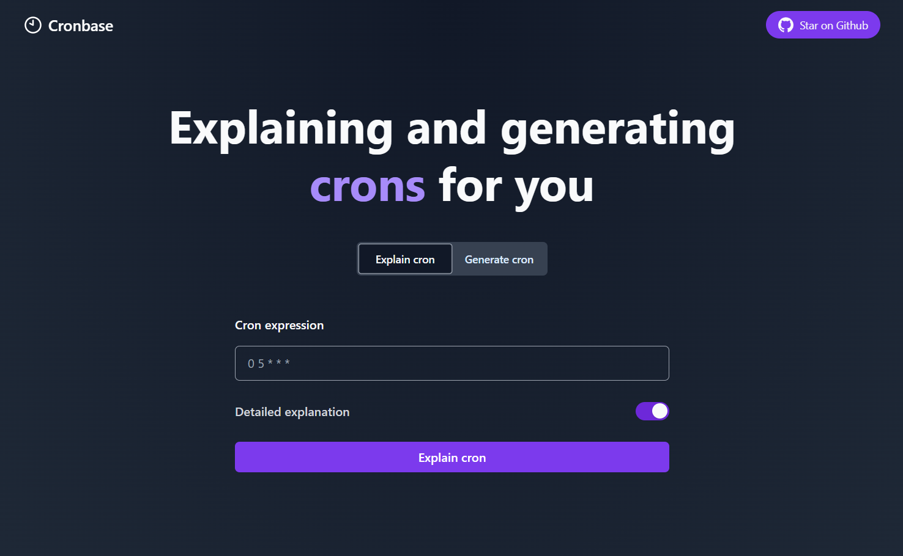

# [Cronbase](https://cronbase.vercel.app/)

This project explains and generates cron expressions. It is bootstrapped with [`create-next-app`](https://github.com/vercel/next.js/tree/canary/packages/create-next-app).

[](https://cronbase.vercel.app/)

## Tech Stack

- [Next.js](https://nextjs.org)
- [Tailwind CSS](https://tailwindcss.com)
- [OpenAI API](https://platform.openai.com/overview)

## Features

- Explain cron expressions
- Generate cron expressions

## Installation

### 1. Clone the repository

```bash
git clone https://github.com/sadmann7/cronbase
```

### 2. Install dependencies

```bash
npm install
```

### 3. Create a `.env` file

Create a `.env` file in the root directory and add the environment variables as shown in the `.env.example` file. You can get the OpenAI API key from [here](https://beta.openai.com/account/api-keys).

### 4. Run the application

```bash
npm run dev
```

The application will be available at `http://localhost:3000`.

## Deployment

Follow the deployment guides for [Vercel](https://create.t3.gg/en/deployment/vercel), [Netlify](https://create.t3.gg/en/deployment/netlify) and [Docker](https://create.t3.gg/en/deployment/docker) for more information.
